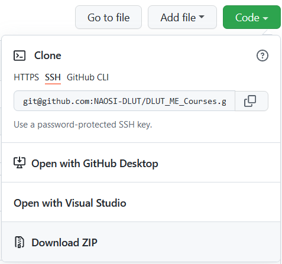

# DLUT_ME_Courses
# 大连理工大学微电子专业课程指南

对于其他文件可以关注[软院的课程REPO](https://github.com/NAOSI-DLUT/DLUT_SE_Courses)

#### 欢迎贡献！！ 欢迎贡献！！ 欢迎贡献！！

## 前言1

**情报**和**资料**永远都是学业成功的重要基石，望着可爱的，接受大学摧残的新生们和学弟们（老腹黑怪了），身为学长不由生出一种母性（淦），😁  。

- 有些是学长学姐亲传的资料
- 有些是你寻找很久的电子参考书
- 有些是前人细心雕琢出的大作业，放在个人的GitHub仓库中，渐渐被遗忘；
- 有些是历年真题，前人费尽心思收集，善良的将他公开，却需要在摸索中下载
- 有些是上完一门课才恍然领悟的技巧。

我也曾很努力地收集各种课程资料，但到最后，某些重要信息的得到却往往依然是纯属偶然。这种状态时常令我感到后怕与不安。我也曾在课程结束后终于有了些许方法与总结，但这些想法无处诉说，最终只能把花费时间与精力才换来的经验耗散在了漫漫的遗忘之中。

我为这一年一年，这么多人孤军奋战的重复劳动感到不平。

本项目希望能够将这些隐晦的、不确定的、口口相传的资料和经验，变为公开的、易于获取的和大家能够共同完善、积累的共享资料。

**消除大部分你需要走的没必要的弯路，同时让大家的学业至少在资料方面是平等的**。这就是我的信念，也是我建立这个项目的原因。

——来自建立DLUT_SE_Courses学长的话

## 前言2

作为以课程数量闻名开发区校区的微电子学院，却一直没有一个能够稳定提供课程/实验/习题参考的平台（毕竟刚成立几年）。找期末习题都找不到的窘境让笔者倍感绝望。

机缘巧合下了解到隔壁软院有一个能够提供课程资料帮助的repo，于是笔者本着开发区就近互助的想法，决定依托NAOSI建立面向微电子学院的课程资料共享平台

如果有可能的话，还希望能够借助这个项目让更多微电子的同学从使用Github开始了解科创——硅农也是新时代农民工，所以用GitHub也是蛮正常的（笑）

学习资料的重复总结-存储-遗忘过程是很低效的，学长学姐费尽心思总结的材料就应该传承下去供学弟学妹使用，学弟学妹在这些成熟资料基础上继续积累新的、更高效的资料，这样才能实现知识的滚动增长，而不是一届又一届的推倒重来。希望本项目及其衍生出的学习资料积累能让每届学弟学妹都能够学习到比学长学姐更多更深入的知识。

## 上传及阅读指南1

本项目的阅读指南：

- 课程攻略：readme.md
- 电子版参考教材：ebook_ [教学年份]_[老师姓名]/（因版权产生问题，请及时issue提醒我）
- 电子版课件 ppt_ [教学年份]_[老师姓名]/
- 平时作业答案与大作业资料：hw/[学号]/ （为保证大家的隐私）
- 历年试卷和复习资料：exam/
- 笔记：note/[学号]/
- 其他请标明用处：  比如编程练习 Excersize/[学号]/

希望项目已经覆盖大多数我系的课程。

比如我是2020年上单世民老师的数据库，想上传一下老师的作业，即在数据库系统文件夹下新建文件夹`2020`，如果有双语课，则为 `2020_双语`，然后往里面填东西即可

> 当然，欢迎往对应的`readme.md`里面放自己的GitHub对应仓库链接 😚

**PS：** 由于本仓库未启用`git-lfs`，因此**请不要上传单个超过100M的文件**，否则commit无效。

同时请尽量不要上传二进制文件例如 `.exe`  ,这会为`github`带来错误

> **微电子的课程相对软院更多更乱，实验课的内容不易清晰分辨，所以上传格式可以随意，但请以文件名标清资料用途**

## 上传及阅读指南2

大多数微电子的同学应该都没有接触过Github，所以在这里尽量以最简单的思路介绍一下如何使用这个仓库

Github是一个用于存储开源项目的网站，里面每个项目都会依托一个叫Git的软件进行管理

Git是一个命令行工具，但是我们在使用Github时不需要敲命令，只需要像使用百度网盘那样即可

1. 首先需要声明：Github的服务器在国外，经常会出现进不去的情况，所以我们*正准备*（Gitee不支持免费存储大文件是个困难情况）在一个中国的开源项目托管网站**Gitee**上对这个项目做一个镜像，如果您遇到无法进入Github的情况，可以考虑转到Gitee按照相同步骤进行操作

2. 您需要注册一个Github账号，流程和注册百度网盘一样，邮箱+密码

3. 从[官网](https://git-scm.com/downloads)下载Git软件，并按照安装程序的指示安装Git，一定注意**在安装过程中勾选里面的“将Git添加到Path”**

    

    可以参考在下面列出的其他教程对Git软件进行进一步配置

4. 登录自己的Github账号，在本项目内点击右上角的fork来复制一份，并在自己的仓库内打开

    

5. 随后，您需要点击右上角的Code来下载这个项目

    

    复制HTTPS选项下面的链接，切换到任意文件夹下鼠标右键打开Git命令行，输入下面的命令

    ```shell
    git clone https://github.com/<这里应该是你的Github账号>/DLUT_ME_Courses.git
    ```

    如果您在此之前已经按照其他教程配置好了Github的SSH，可以使用SSH选项下面的链接，输入命令

    ```shell
    git clone git@github.com:<这里应该是你的Github账号>/DLUT_ME_Courses.git
    ```

    一般来说Github使用SSH比HTTPS下载更快一些

6. 直接在项目文件夹内修改，注意**不要加入大于100MB的单个文件**，否则会无法提交

7. 使用以下指令将本地修改同步到Github的仓库

    ```shell
    git add .
    git commit -m "这里简述做了什么修改"
    git push origin
    ```

    如果报错可以检查一下有没有添加大于100MB的单个文件，或者自己的Github仓库（<Github用户名>/DLUT_ME_Courses）有没有完成更新

8. 等待完成push后进入Github的仓库，点击`pull requests`-`new pull request`

    

    

    随后会进入代码比较界面，可以将自己添加的文件和主目录进行比较

    注意一定不要选错左侧的分支

9. 等待主分支的管理人员审核完毕，您的提交就会被加入主分支啦

> 更多资料可参考
>
> https://blog.csdn.net/qq_41782425/article/details/85183250
>
> https://www.cnblogs.com/ttjsndx/p/7943444.html
>
> https://blog.csdn.net/weixin_41697143/article/details/81837369
>
> https://www.jianshu.com/p/458127e40f30

如果有不清楚的地方，也欢迎加入NAOSI的交流群提问！

## 参与我们的项目

电脑前的您请不要吝啬，对于您的任何提交我们十分欢迎，您的作品一旦被合并至该仓库中，有可能会被无数学弟仰慕。我们需要您的PR！

如果你关于学校或者课程有很多疑问，请多向我们提 issue ，力所能及的范围我们都是会回答你的，但提问前请先参阅  [怎样提出一个好问题](https://github.com/ryanhanwu/How-To-Ask-Questions-The-Smart-Way/blob/master/README-zh_CN.md) 十分感谢！！

我们会尽可能将你们所提的issue整合成 Q&A ，并整理为一个文件，这项工作有待完善，欢迎大家参与！！ 😄

## 许可

由贡献者编写部分的许可如下：

[(Creative Commons BY-SA 4.0) 知识共享署名 - 相同方式共享 4.0 国际许可协议](https://creativecommons.org/licenses/by-nc-sa/4.0/deed.zh)

[The Star And Thank Author License](https://github.com/zTrix/sata-license)

真正版权归属于其各自的作者。资料仅供参考，请自己判断其适用性。

## 参考

#### [清华大学](https://github.com/Salensoft/thu-cst-cracker) 、[浙江大学](https://github.com/QSCTech/zju-icicles) 、[上海交通大学](https://github.com/c-hj/SJTU-Courses) 、[北京大学](https://github.com/lib-pku/libpku)  大家也可借鉴参阅

